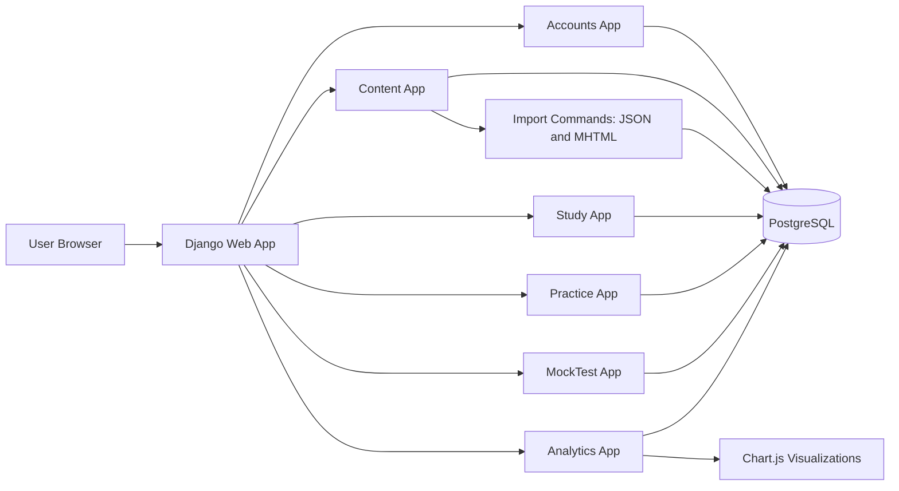
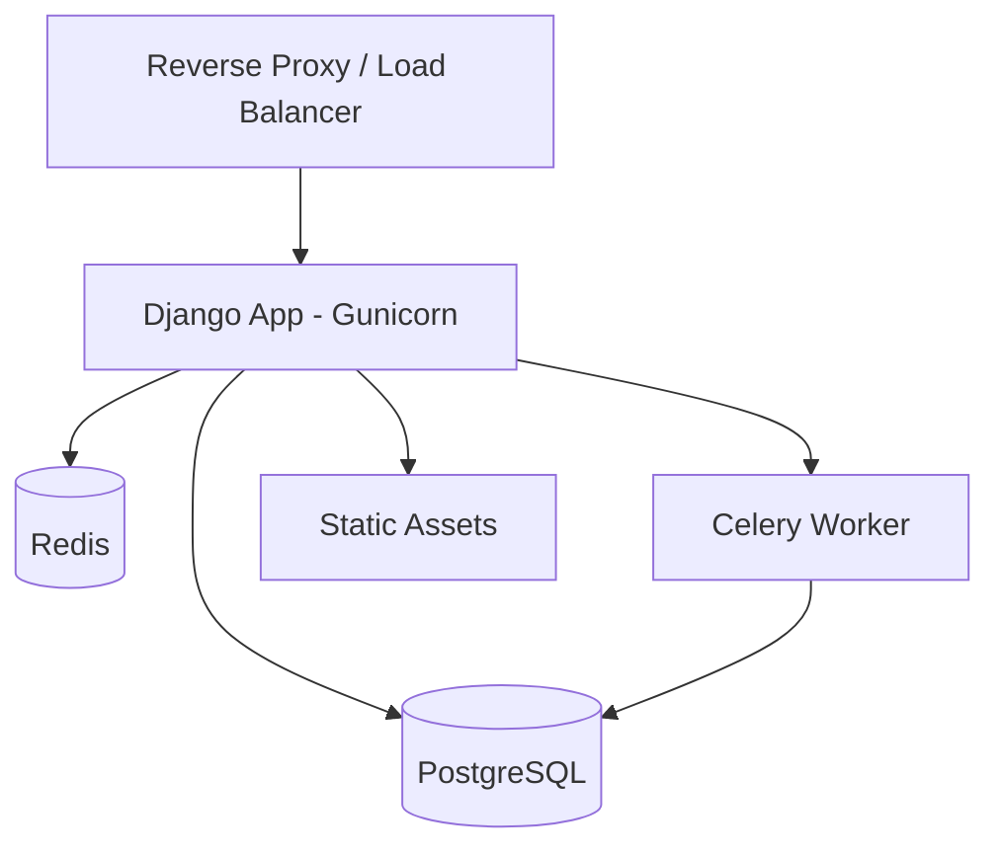

# Solution Architecture (Django)

## 1. Proposed Stack
- Backend: Django 5 + Django ORM
- DB: PostgreSQL
- Frontend: Django templates + Bootstrap 5 + custom theme tokens
- Charts: Chart.js
- Optional async jobs: Celery + Redis (for heavy analytics/imports)

## 2. Django App Boundaries
- `accounts`: registration, login, profile, password change, active-window banner
- `content`: topics, study plan, imported study pages from MHTML
- `study`: study navigation and study progress tracking
- `practice`: practice sessions, responses, progress metrics
- `mocktest`: mock sessions, blueprint generation, timer, behavior tracking
- `analytics`: dashboard aggregations and insight generation

## 3. High-Level UML Component Diagram

## 4. Request/Response Patterns
- Server-rendered pages for low complexity and faster development
- AJAX endpoints for:
  - answer submission
  - per-question engagement pings
  - progress updates
  - dashboard metric refresh blocks

## 5. Auth and Active-Window Strategy
- On registration, set `active_until = date_joined + 30 days`
- A context processor injects `remaining_days` for a global banner
- Middleware can block restricted flows when membership expired

## 6. Intelligence/Insights Pipeline
- Raw events from practice/mock tracked per question
- Session summaries computed at session end
- Dashboard-level aggregates generated from summary tables

## 7. Study Content Ingestion
- MHTML parser management command extracts relevant body content
- Sanitize and normalize into internal HTML blocks
- Store references for chapter/topic/page hierarchy

## 8. Deployment-Ready Architecture (Target)

## 9. Why this architecture
- Fast to ship with Django templates
- Strong data consistency for progress tracking
- Easy extension for APIs or mobile clients later
- Clear domain boundaries for future team scaling
