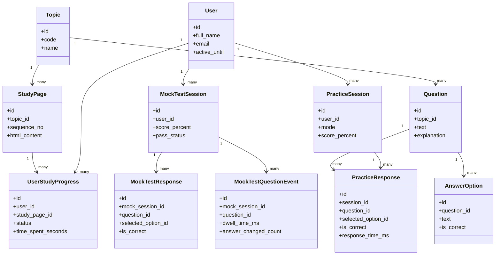

# Data Model and Tracking Plan

## 1. Core Entities

### 1.1 Accounts
- `User`
  - id
  - full_name
  - email (unique)
  - password
  - date_joined
  - active_until
  - is_active

### 1.2 Content and Study
- `Topic`
  - id
  - code (1..5)
  - name
- `StudyPage`
  - id
  - topic (FK)
  - sequence_no
  - title
  - source_file
  - html_content
- `StudyPlanItem`
  - id
  - title
  - description
  - order_no
  - week_no

### 1.3 User Study Progress
- `UserStudyProgress`
  - id
  - user (FK)
  - study_page (FK)
  - status (not_started, in_progress, completed)
  - time_spent_seconds
  - last_viewed_at
  - completed_at

### 1.4 Question Bank
- `Question`
  - id
  - topic (FK)
  - text
  - explanation
  - difficulty (optional)
- `AnswerOption`
  - id
  - question (FK)
  - text
  - is_correct
  - display_order

### 1.5 Practice Tracking
- `PracticeSession`
  - id
  - user (FK)
  - mode (random_10, random_20, random_30, all, unanswered)
  - selected_topics (M2M or JSON)
  - started_at
  - ended_at
  - total_questions
  - correct_answers
  - score_percent
- `PracticeResponse`
  - id
  - session (FK)
  - question (FK)
  - selected_option (FK nullable)
  - is_correct
  - response_time_ms
  - answered_at
  - explanation_viewed (bool)

### 1.6 Mock Test Tracking
- `MockTestSession`
  - id
  - user (FK)
  - started_at
  - submitted_at
  - duration_seconds
  - total_questions (24)
  - correct_answers
  - pass_status
  - score_percent
- `MockTestQuestionEvent`
  - id
  - mock_session (FK)
  - question (FK)
  - question_order
  - entered_at
  - exited_at
  - dwell_time_ms
  - revisit_count
  - answer_changed_count
- `MockTestResponse`
  - id
  - mock_session (FK)
  - question (FK)
  - selected_option (FK nullable)
  - is_correct
  - answered_at

### 1.7 Analytics Summary
- `TopicPerformanceSnapshot`
  - id
  - user (FK)
  - topic (FK)
  - source_type (study/practice/mock)
  - attempts
  - accuracy_percent
  - avg_time_ms
  - snapshot_date

## 2. UML Class Diagram (Logical)

## 3. Import Strategy
- Command 1: import questions from `lituk_questions_422.json`
- Command 2: import study pages from all MHTML files in `web_back`
- Command 3: build study plan entries from source study plan content

## 4. Notes
- Keep immutable copies of original imported source metadata
- Never store plaintext passwords
- Add indexes on `(user, topic)` and `(session, question)` for analytics speed
