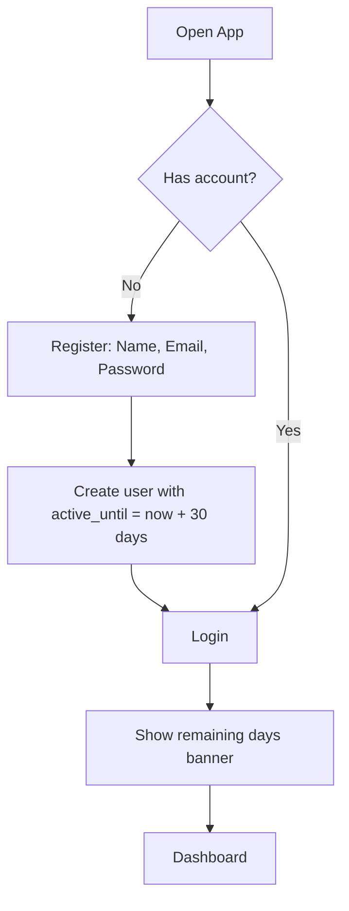
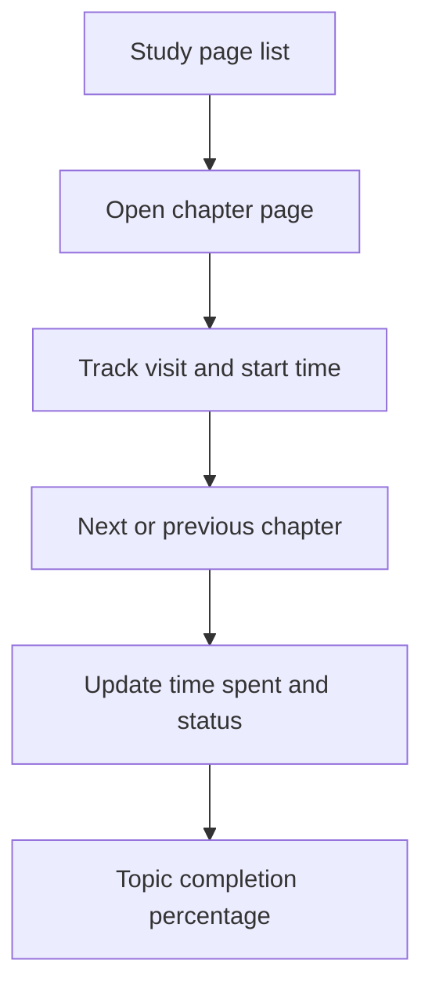
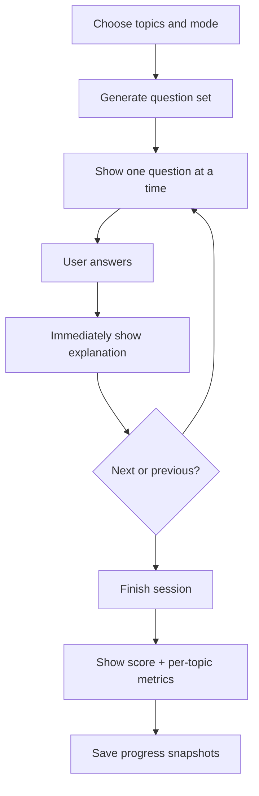
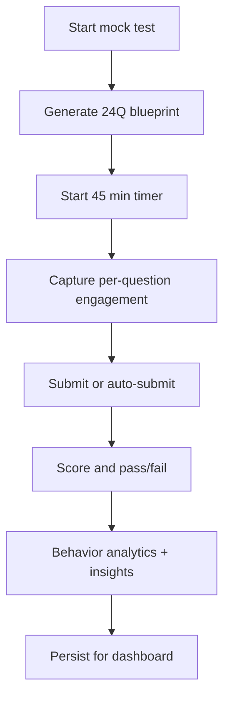

# User Flows and UX Blueprint

## 1. UX Direction
- Bold and simple visual language
- Bootstrap 5 base + custom color tokens + large touch targets
- Mobile-first layout with responsive cards/charts

## 2. Main Navigation
- Dashboard
- Study Plan
- Study
- Practice
- Mock Test
- Profile

## 3. Flow: Register and Login

## 4. Flow: Study

## 5. Flow: Practice Session

## 6. Flow: Mock Test Session

## 7. Dashboard Experience
- Top cards:
  - Active days remaining
  - Overall readiness score
  - Last mock score
  - Practice streak
- Charts:
  - Topic-wise accuracy (bar chart)
  - Study completion by topic (horizontal bars)
  - Practice and mock trend over time (line chart)
- Insights:
  - weakest topic
  - slowest topic by response time
  - recommendation list (next 3 actions)

## 8. UX Enhancements to include in build
- Sticky action area for mobile in practice/mock
- Unanswered question indicator
- Jump-to-question navigator
- Session resume where safe
- Accessible contrast and keyboard navigation
